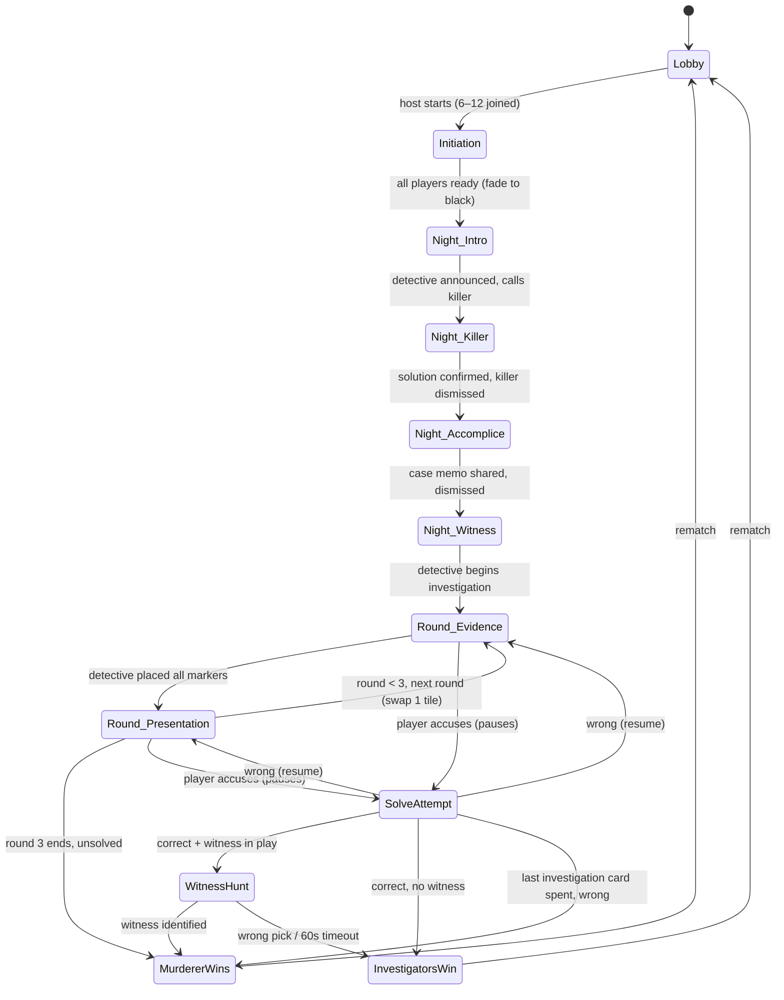
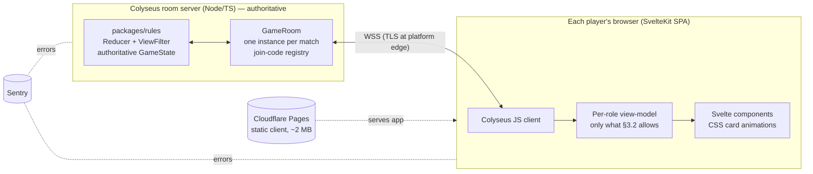

# গোয়েন্দাগিরি (Goyendagiri) — Full Design & Development Document

**Version:** 1.2 · **Date:** 2026-07-09 · **Owner:** Tomal
**v1.1:** Initiation phase + Detective-orchestrated Night Sequence redesign; two rule vamps (killer never learns accomplice; witness learns murderer only)
**v1.2:** Stack decision — **web-native** (TypeScript + Svelte + Colyseus) replaces Unity Web. Rationale recorded in §6.2; Unity research retained in Appendix E.
**v1.3:** Marker confirm step; 4–12 players in MVP; ∞ presentation timer + pass/force-pass; self-accusation allowed; accomplice publicly revealed at witness hunt; grace 2 min; start blocked below 4; Sheets→art pipeline specced; suspect grid (4-col, v-scroll) + Easy Investigate overview mode.
**v1.4:** Visual identity locked — **Candlelit Noir** (§5.6); mockup restyled with CSS design tokens + drop-in art hooks; `docs/Artwork-Pipeline-Guide.md` added (asset inventory, generation rules, budgets).
**v1.5:** **MVP built** in `goyendagiri/` (rules engine ✅ tests · Colyseus server ✅ e2e bot game · Svelte client ✅ builds). Codebase map: `docs/Project-Graph.md` (maintained every session). Known gaps listed in `goyendagiri/README.md`.
**v1.6:** Three rule/UX revisions, implemented & verified (28 tests): **(1) Final decision round** — after the last presentation round, players with unspent investigation cards must vote or abstain before the murderer can win; timeout-to-loss replaced by an active climax. **(2) Verdict mode** (lobby setting Auto | Detective): in Detective/orchestrated mode the game never auto-judges — every accusation pops a verdict card on the Detective's screen ("X votes Y as the killer with these cards — do you agree?") and the Detective's Yes/No IS the outcome, exactly like the tabletop; timers pause while a verdict is pending. **(3) Tile swap rework** — the Detective now draws **2** scene tiles via a deck overlay, keeps one (the other returns to the deck bottom), and chooses which of the 4 table tiles it replaces; the draw is Detective-only knowledge (leak-tested). Also: lighter background scrim; `docs/Content-Authoring-Guide.md` added (content lives in `content.ts` until the Sheet pipeline is built).
**Companion file:** `mockups/goyendagiri-ui-demo.html` (interactive desktop/mobile UI demo — open in any browser)

---

## 1. Executive Summary

Goyendagiri is a 4–12 player, web-based, hidden-role social deduction card game adapted from a physical rulebook. One player (the Detective) knows the murder solution and communicates only through marker placements on clue tiles; the Murderer hides among the players; Investigators race to identify the exact Evidence + Means-of-Murder card pair before three rounds expire.

**Locked decisions** (from planning session):

| Decision | Choice |
|---|---|
| Stack | **Web-native**: TypeScript + Svelte (client), Colyseus/Node (authoritative server), PixiJS reserved for later vfx — decided v1.2, rationale §6.2 |
| Developer profile | Solo, mid-senior Unity/C# — TS/web learning curve budgeted into the plan (§10) |
| Voice | External (Discord) for MVP; SDK later |
| Launch scope | Friends-play MVP: private rooms, invite links, **no accounts** |
| Languages | Bangla + English from day one |
| Budget target | $0–10/month infrastructure |

**Headline verdicts (v1.2):**

1. **Stack is web-native, not Unity.** Deciding factors: ~2 MB instant-load client vs 15–25 MB WASM (critical for click-a-link party play), native browser Bangla shaping (deletes the project's biggest text-rendering risk), the HTML mockup evolving directly into the product, and a server-authoritative design from day one. Full rationale and revisit-conditions in §6.2.
2. **The server is authoritative from day one** (Colyseus room server). This deletes the two worst caveats of the earlier client-hosted design: a cheating-capable host and games dying when the host disconnects.
3. **Bangla rendering is a solved problem in browsers** — HarfBuzz shaping is built in. The remaining work is font choice and subsetting, not correctness.
4. Infrastructure remains **$0/month for MVP** (Cloudflare Pages client + free-tier Node host), ~$5–10/month at real usage.

---

## 2. Product Overview

### 2.1 Design pillars

1. **The board is the conversation.** Everything players argue about (tiles, markers, face-up cards) must be visible or one tap away at all times, on both form factors.
2. **Digital does the bookkeeping, humans do the deception.** The app automates dealing, role secrecy, timers, and win checking. It never automates persuasion.
3. **Bangla-first presentation.** Bilingual UI where Bangla is a first-class script, not a translated afterthought.
4. **Friends around a virtual table.** No accounts, no matchmaking, no grind. A room code and 15 minutes.

### 2.2 Target audience & session profile

- Friend groups of 4–12, mixed device usage (expect ~60% mobile in a Bangladeshi audience — mobile layout is not optional).
- Session length: ~15–25 minutes per game; lobby designed for immediate rematch.
- Voice on Discord in parallel; the game is the shared board (Codenames-online model).

### 2.3 Scope

**In MVP:** private rooms with join codes/links, **4–12 players** (role set auto-adjusts, §3.1), full rulebook loop (night phase, 3 rounds, solve attempts, witness hunt), text chat + system log, Bangla/English toggle, easy/normal/hard difficulty, Easy Investigate overview mode, reconnect handling, desktop + mobile browser layouts.

**Explicitly OUT of MVP (non-goals):** accounts/profiles, public matchmaking, voice/video, spectators, ranked/stats persistence, event tiles variant, native mobile apps, monetization, moderation tooling. Each is listed in the roadmap (§16) — do not let any of them creep into MVP.

### 2.4 An honest note on IP

The rule structure closely parallels *Deception: Murder in Hong Kong* (Grey Fox Games). Game **mechanics are not copyrightable**, so a digital game with these rules is legally defensible — but **card text, art, graphic design, and trade dress are protected**. Your original Bengali lore, card names, and visual identity are your protection: author all card/tile content yourself, never copy Deception's card lists or layouts, and don't market it as "Deception online." If this ever goes commercial, get a real legal opinion. (I am not a lawyer; this is orientation, not legal advice.)

---

## 3. Game Design — Digital Adaptation of the Rulebook

The rulebook was written for a table. Every physical ritual needs a digital equivalent, and several ambiguities must be decided now (an ambiguous rule in a digital game is a bug). Rulings below are final for MVP.

### 3.1 Roles & counts (4–12 players)

| Players | Detective | Murderer | Accomplice | Witness | Investigators |
|---|---|---|---|---|---|
| 4–5 | 1 | 1 | 0 | 0 | 2–3 |
| 6 | 1 | 1 | 1 | 1 | 2 |
| 8 | 1 | 1 | 1 | 1 | 4 |
| 12 | 1 | 1 | 1 | 1 | 8 |

At 4–5 players there is no Accomplice or Witness: night beats 4–5 skip automatically (§3.4) and the witness hunt never triggers — a correct solve wins outright.

- Roles are assigned **server-side, cryptographically random** at game start.
- Detective assignment is a lobby setting: **Random** (default) or **Volunteer** (host picks a willing player). Rationale: the Detective role is a game-master role; forcing it on a first-timer ruins the game.
- The Detective's role is public; all others secret.

### 3.2 Information visibility matrix (the heart of the implementation)

This table is the single source of truth for what each client is ever allowed to receive. Any network message violating it is a game-breaking bug.

| Information | Detective | Murderer | Accomplice | Witness | Investigator |
|---|---|---|---|---|---|
| Own role | ✔ | ✔ | ✔ | ✔ | ✔ |
| Everyone's face-up cards | ✔ | ✔ | ✔ | ✔ | ✔ |
| Solution (which 2 cards) | ✔ | ✔ | ✔ | ✘ | ✘ |
| Murderer's identity | ✔ | ✔ | ✔ | ✔ | ✘ |
| Accomplice's identity | ✔ | ✘ | ✔ | ✘ | ✘ |
| Witness's identity | ✔ | ✘ | ✘ | ✔ | ✘ |
| Tile/marker state | ✔ (writes) | ✔ | ✔ | ✔ | ✔ |
| Solve attempts & results | ✔ | ✔ | ✔ | ✔ | ✔ |

Three deliberate deviations from the physical game, all reflected above:

1. **The Detective learns the Witness's identity.** Structural in v1.1: the Detective personally calls the Witness during the night sequence (§3.4), so hiding it is impossible and pointless — the Detective is trusted by design.
2. **The Murderer never learns who the Accomplice is during play** (your vamp). Trust flows one way: the Accomplice knows the killer and the solution; the killer plays blind. Exception (v1.3): if the witness hunt triggers, both are publicly revealed for the final stand (§3.4).
3. **The Witness learns the Murderer's identity only** (your vamp) — not the Accomplice's. This slightly strengthens the murderer team (the Accomplice can vouch for the killer without the Witness knowing to distrust them) and makes the witness hunt harder to dodge.

### 3.3 Phase state machine



### 3.4 Phase-by-phase digital rulings

**Initiation phase (deal cinematic + ready check).** When the host starts, the server commits ALL assignments instantly (roles, card deals, seed); what follows is pure client-side theatre — no information is in flight during animations, so skipping is always safe.
- Every player watches the character deck shuffle; one card flies to screen center back-faced, then **twirls to reveal their role**. Their N Evidence + N Means cards (N = 3/4/5 by difficulty) then deal in with the same flourish, plus their Investigation Card. A "skip" tap jumps to the final layout.
- **Ready roster, top-left:** every player's avatar with a live ready/waiting status. Tapping **Ready** (enabled after your reveal completes) flips your status for everyone — the whole lobby always knows who's holding things up.
- Every non-Detective player holds exactly one Investigation Card — **including the Murderer and Accomplice** (physical parity: they can bluff-guess to burn suspicion, at the real risk of accidentally solving the crime). The Witness holds one too.
- When the last player readies: screens fade to black → night sequence.

**Night sequence — Detective-orchestrated (replaces the eyes-closed ritual).** A fixed six-beat script that the Detective advances with console buttons, mirroring the tabletop call-and-response. At every beat, all non-active players see the same uniform waiting screen: *"গোয়েন্দা ঘটনাস্থল বিশ্লেষণ করছেন… / Detective is analyzing the scene of murder."*

1. **Announce.** All screens reveal who the Detective is (public role). The Detective's console appears.
2. **Call the Killer.** Detective presses the call button → a Reveal button appears on the killer's screen only. On tap, killer and Detective enter a linked view: the killer picks 1 Evidence + 1 Means **from their own cards**; selections highlight live on both screens; killer confirms.
3. **Dismiss the Killer** ("close your eyes"). Killer's screen returns to the waiting screen. The Detective's HUD gains a persistent **case memo** (top-right): killer's avatar + name + the two chosen cards — no memorizing, exactly as you specced.
4. **Call the Accomplice.** Accomplice taps Reveal → the system auto-displays the killer's identity + solution to the accomplice, and the Detective presses one Confirm button (ruling: the system shows, the Detective confirms — manual re-marking by the Detective is ritual with a mis-click failure mode, so it's automated). The accomplice's HUD gains the same case memo. Dismiss.
   **Rule vamp (deliberate, yours):** the killer is never told who the accomplice is — trust flows one way.
5. **Call the Witness.** Witness taps Reveal → the system shows the **murderer's identity only** (vamp: the witness no longer learns the accomplice). Dismiss — witness's screen returns to waiting.
6. **Begin Investigation** (= "everyone open your eyes"). The board loads for all players simultaneously. Role HUDs persist as overlays on the board UI: case memo for Detective + Accomplice, a murderer-tag for the Witness.

Knock-on rulings:
- **The old 20 s anti-timing-leak minimum is obsolete and dropped.** The sequence is Detective-paced and every bystander sees one identical screen; call/reveal timing identifies nobody (the Reveal button renders only on the called player's screen — never send it to others and hide it client-side, that would leak via memory inspection).
- **Called-role disconnect:** the Detective's call buttons show the target's connection dot; if a called player doesn't respond, standard §3.5 grace rules apply (killer unresponsive in night = pause → abort).
- **4–5 player games (in MVP, v1.3):** beats 4–5 skip automatically — the script is data-driven.

**Evidence gathering.** The Detective sees the tile tray: Cause-of-Death tile + 1 of 4 Location tiles (Detective picks which location tile is dealt — mirrors "selected from the 4 available") + 4 random Scene tiles. Detective places 6 markers, one per tile, each on one of the tile's 6 words, at their own pace, via tap/click. **Marker placement is a two-step commit (v1.3, human-error guard):** the Detective taps a word → it highlights *only on the Detective's screen* with a **Confirm marker** button → confirm broadcasts and locks it. Nothing is sent before confirm, so a stray tap leaks nothing and costs nothing. Each confirmed placement is broadcast and logged ("🎩 Marker placed: ডাকাতবাড়ি"). Confirmed markers are **final** (physical parity; prevents information-by-repositioning). Free chat for everyone except the Detective (Golden Rule 1: Detective's chat is disabled for the whole game — the UI enforces the rule instead of trusting discipline).

**Presentation.** Order = seating order starting from the seat after the Detective (seating order = join order, shown identically to all players). Each non-Detective player gets a timer, lobby-configurable: **30 / 45 / 60 s / ∞ (Infinite)**. Timed modes auto-advance and show a **Pass** option to end early. In Infinite mode the timer area is replaced by the **Pass** button — the presenter ends their own turn when done. The Detective always has a **Force-pass** button (⚠ logged: "🎩 Detective ended Rakib's turn") to move disruptive or AFK presenters along — its main purpose is Infinite mode, but it works in all modes. During a presentation, **chat is disabled for everyone except the presenter**; the only allowed interruption is pressing **Solve** (Golden Rule 2, enforced by UI). Note: with Discord voice, timer enforcement is social, not technical — the prominent countdown plus force-pass is enough.

**Rounds 2–3 tile swap.** Detective selects 1 of the 4 Scene tiles to discard; a replacement is **drawn randomly by the server** (Detective does not browse the deck — parity with drawing blind), then places its marker. Cause and Location tiles never leave.

**Solve attempt.** Available to any non-Detective player with an unspent Investigation Card, at any time including during presentations (Golden Rule 2 overrides the §6 presentation restriction — adopted ruling: Solve is always allowed and pauses all timers). Flow: pick suspect → pick 1 of their Evidence → 1 of their Means → confirm through a deliberate-friction warning. The attempt and its cards are **publicly broadcast**, result is automated: correct → win sequence; wrong → "না / No", card consumed, game resumes. **Concurrency ruling:** server (host) processes attempts in arrival order; a second attempt arriving while one resolves is queued and its player re-confirms after seeing the first result.

**Self-accusation ruling (v1.3): allowed.** A player may accuse any player *including themselves* — this matches the physical game, where nothing stops you naming your own cards. Strategic texture it adds: an investigator can burn their card on themselves as a (bad) bluff, and the murderer can self-accuse *incorrectly* to look eager. Note the edge the rules engine must handle: a murderer self-accusing **correctly** ends the game as an investigator-team win per §7 of the rulebook (any player's correct solve counts) — write a unit test for exactly this.

**Witness hunt.** Triggered on a correct solve when a Witness is in play. **On trigger, the Murderer AND the Accomplice are publicly revealed to everyone (v1.3)** — a dramatic banner moment mirroring the tabletop, where the culprits openly confer for their last stand. This supersedes the v1.1 anonymity ruling: the killer learns the accomplice here too, which is harmless — the deduction game is already over. The revealed pair get a team chat channel (visible only to them; investigators shouldn't hear the reasoning) and 60 s; the **Murderer confirms the final pick** (Accomplice can nominate). Timeout with no pick = investigators win. Valid targets: every player except the Detective, the Murderer, and the Accomplice (the Detective is public and cannot be the Witness; the team obviously doesn't pick itself).

**End & rematch.** Full role reveal, winner banner, one-tap rematch keeping the room and seats (roles reshuffle; used cards return to deck and redeal).

### 3.5 Disconnect & edge-case rulings

| Event | Ruling |
|---|---|
| Any player disconnects | **2 min** reconnect grace (session token in browser storage); seat shows ⚠︎; game continues except below |
| Detective disconnects | Game pauses (hard requirement — nothing can proceed) |
| Murderer disconnects in night phase | Pause; if grace expires, **abort to lobby** (game is unstartable without a solution) |
| Murderer/Accomplice/Witness disconnects mid-game permanently | Game continues; their cards remain accusable; witness hunt skipped if Witness seat is dead at trigger time (investigators win outright) |
| Investigator disconnects permanently | Presentation slot auto-skipped; cards remain on the table and accusable |
| Room creator disconnects | Just a player (server is authoritative, v1.2): lobby privileges pass to the next seat; the game is unaffected |
| Player count drops below 4 mid-game | Game continues (roles are already dealt); lobby blocks *starting* below 4 only |

**iOS Safari tab-suspend warning:** mobile Safari aggressively suspends background tabs — a player switching to Discord *will* disconnect briefly. The 2 min grace and silent auto-reconnect exist primarily for this; treat reconnect flow as a core feature, not polish, and test it on a real iPhone early (M0 spike, §11).

### 3.6 Difficulty & variants

- Easy 3+3 / Normal 4+4 / Hard 5+5 cards per player (lobby setting).
- Event tiles: **post-MVP** (roadmap). They require bespoke logic per tile; ship the base game first.
- 4–5 player mode (no Accomplice/Witness): **in MVP** as of v1.3 — the role table (§3.1) and night script are data-driven, so it's the same code path with two roles absent.

---

## 4. Content Specification

### 4.1 Content inventory

Physical game: 70 Means, 150 Evidence, 26 clue tiles (1 Cause + 4 Location + 21 Scene) + 6 Event tiles. Digital MVP minimums, derived from worst case (12 players, hard mode ⇒ 11×5 = 55 of each card type dealt):

| Asset | MVP count | Full count | Notes |
|---|---|---|---|
| Evidence cards | 80 | 150 | ≥55 required; 80 gives variety across games |
| Means cards | 60 | 70 | ≥55 required — this is the tight one |
| Cause-of-Death tile | 1 (6 options) | 1 | fixed |
| Location tiles | 4 (6 words each) | 4 | fixed |
| Scene tiles | 16 | 21 | ≥7 used per game (4 + up to 2 swaps + discards) |
| Event tiles | 0 | 6 | post-MVP |

### 4.2 Authoring pipeline

All content lives in **one Google Sheet → exported to JSON** at build time (columns: `id, type, bn, en, tags, difficulty`). No card text in scenes or prefabs, ever. Schema:

```json
{
  "id": "ev_017",
  "type": "evidence",
  "bn": "ছেঁড়া চিঠি",
  "en": "Torn letter",
  "icon": "torn-letter",
  "tags": ["paper", "personal"]
}
```

```json
{
  "id": "tile_scene_04",
  "type": "scene",
  "title_bn": "আবহাওয়া", "title_en": "Weather",
  "words": [
    {"bn": "বৃষ্টি", "en": "Rain"},
    {"bn": "কুয়াশা", "en": "Fog"},
    {"bn": "ঝড়", "en": "Storm"},
    {"bn": "গরম", "en": "Heat"},
    {"bn": "শীত", "en": "Cold"},
    {"bn": "পরিষ্কার", "en": "Clear"}
  ]
}
```

**Art & the Sheet (v1.3 — how images fit):** the Sheet stores *data and references*, never image files. The `icon` column is a key into the shared SVG icon set; a future `art` column holds a filename/id. Artwork itself lives in the repo (`apps/client/static/cards/<id>.webp`) and is joined by id at render time with a deterministic fallback chain: **full art if the file exists → icon + name template if not**. Adding art to a card later is a pure asset drop plus one cell edit — zero code changes, and cards without art never look broken.

**How card data reaches the game:** build-time, not runtime. A build script pulls the Sheet (Sheets API, or the simpler publish-as-CSV URL) → validates with zod (unique ids, both languages present, referenced icon exists, min deck counts per §4.1) → emits `content/cards.json` + `content/tiles.json`, committed to the repo. Client and server import the same JSON module, so content is versioned with the code and covered by the §12.1 version handshake. **The Sheet is an authoring tool, not infrastructure** — the game has no runtime dependency on Google; if Sheets vanished tomorrow, the committed JSON is the source of truth.

**Content design rules** (what makes this game work): every Means card must be plausibly connectable to ≥3 Cause-of-Death words; Evidence cards should be everyday objects with narrative ambiguity; avoid pairs so unique that one marker gives the game away. Budget 2–3 dedicated content-writing days — it is real design work, not data entry, and it's the part no library can do for you.

### 4.3 Card content is data, art is systemic

MVP art = **one template per card type** (yellow evidence frame, blue means frame) + per-card **icon + name** (e.g. a poison-flask icon + "বিষ · Poison") from a shared icon library (game-icons.net has 4000+ CC-BY icons that fit this exactly). Full per-card illustrations are a post-MVP art pass — plan the card layout with an art slot now so upgrading is a data swap, but do NOT block MVP on 150 illustrations (project-killer for a solo dev). Tile = title + 6 word-slots template. Add an `icon` field to the card schema (§4.2).

---

## 5. UX / UI Design (the critical design decision)

Open **`mockups/goyendagiri-ui-demo.html`** in a browser — it shows all five key screens in both desktop and mobile layouts and is the visual reference for this section.

### 5.1 The core UI problem

At 12 players × 8 face-up cards, there are **88 suspect cards + 6 tiles + chat + timers** competing for screen space. This is the game's make-or-break UI problem, and it forces different information architectures per form factor — not a scaled-down desktop UI.

### 5.2 Desktop layout (≥1024 px)

```
┌────────────────────────────────────────────────┬──────────┐
│ topbar: logo · phase chip · round pips · timer │          │
├────────────────────────────────────────────────┤  chat /  │
│                                                │  log /   │
│         TILE BOARD (3×2 grid, markers)         │  my-role │
│                                                │  tabs    │
├────────────────────────────────────────────────┤ [EASY    │
│  SUSPECT GRID: 4 columns × N rows, vertically  │  INVEST.]│
│  scrollable when >8 non-Detective players;     │          │
│  each seat = avatar + 8 mini-cards             │ [SOLVE]  │
└────────────────────────────────────────────────┴──────────┘
```

- Tiles are permanently visible at readable size — they're what the Detective is "saying."
- **Suspect grid (v1.3):** a fixed **4-column grid** that grows downward and scrolls vertically — at ≤8 non-Detective players everything fits in two rows with no scrolling; at 9–11 a third row scrolls into view. (Replaces the v1.0 horizontal rail: vertical scroll is a stronger convention, and 4 columns keeps mini-cards at readable width on 1280 px+.)
- Mini-cards are readable at 44×60 px with 2-line Bangla+English labels; hover enlarges. The currently-presenting player's seat glows.
- Right sidebar tabs: Chat / System log / My role. The log records every marker placement and solve attempt — it's the game's memory and settles arguments.

### 5.3 Mobile layout (<1024 px, portrait-first)

```
┌──────────────────────────┐
│ compact topbar + timer   │
├──────────────────────────┤
│  TILE BOARD (2×3 grid)   │
├──────────────────────────┤
│ avatar carousel (h-scroll)│
├──────────────────────────┤
│ BOTTOM SHEET: tapped     │
│ player's 8 cards         │
├──────────────────────────┤
│ [Solve][Easy][Chat•3][🎭]│  ← sticky action bar
└──────────────────────────┘
```

Key mobile decisions:

1. **Board-first, one-suspect-at-a-time.** The tile board keeps priority; suspects collapse to an avatar carousel that opens a card bottom-sheet. Comparing two suspects requires two taps — an accepted cost; the alternative (tiny unreadable cards) is worse.
2. **Chat is an overlay, not a pane.** Toggled from the action bar with an unread badge. With Discord voice running, in-game chat is secondary on mobile.
3. **Sticky action bar** keeps Solve reachable at all times (rule: solve anytime), thumb-zone placed.
4. **Portrait is the designed orientation.** Landscape works but is not optimized. 44 px minimum touch targets throughout.
5. **Battery/perf:** static camera, no per-frame animation outside transitions; target 30 fps cap on mobile web to keep thermals civil.
6. **Easy Investigate** lives in the sticky action bar — on mobile it's arguably more valuable than on desktop, since it's the only way to see all suspects at once.

### 5.4 Easy Investigate — the deduction overview (v1.3, both form factors)

One tap opens a full-screen overlay optimized for *cross-referencing*, not browsing:

- **Top strip — the clue summary:** each of the 6 tiles reduced to `tile title → marked word` chips (e.g. "মৃত্যুর কারণ → রক্তক্ষরণ"). No unmarked words, no tile art — only what the Detective actually said.
- **Below — every suspect at once:** all non-Detective players in a compact grid; each card shrinks to **icon + name only** (no card art, no frames) as a small chip, color-coded evidence/means. At 11 suspects × 8 cards = 88 chips, this fits one desktop screen and one short mobile scroll.
- Spent-investigation-card and presenting indicators carry over; tapping a player jumps back to their full seat view.
- Read-only by design: no accusing from this view (the Solve flow's deliberate friction stays mandatory). It's the "detective's corkboard" — the view players will stare at during discussion.

Implementation note: pure client-side view over data the client already has — no new network messages.

### 5.5 Screen inventory

| # | Screen | Demo tab | Notes |
|---|---|---|---|
| 1 | Landing / join (enter nickname, room code, or create) | — | trivial; not mocked |
| 2 | Lobby | 1 | settings, player chips, copy-link |
| 3 | Initiation (deal cinematic + ready check) | 2 | role-card twirl reveal, ready roster top-left |
| 4 | Night sequence (Detective console + per-role variants) | 3 | beat stepper, call/dismiss buttons, case-memo HUD; killer's linked pick view; uniform waiting screen |
| 5 | Investigation board | 4 | THE screen; both layouts mocked; role HUDs overlay; suspect grid 4-col |
| 6 | Easy Investigate overlay | 5 | clue-summary strip + all suspects as icon+name chips |
| 7 | Solve modal (3-step) | 6 | deliberate friction before consuming the card |
| 8 | Endgame / witness hunt / reveal | 7 | rematch loop; accomplice publicly revealed at hunt |

### 5.6 Visual identity — Candlelit Noir (v1.4)

Chosen from four AI-rendered concept directions: **warm plum-brown darks + antique gold, candlelit village-mystery.** Design tokens (implemented in the mockup — it IS the design system now):

| Token | Value | Use |
|---|---|---|
| `--bg` / `--panel` / `--panel2` / `--panel3` | #160f14 / #241722 / #2b1c28 / #3a2636 | surfaces, warm plum-brown ramp |
| `--ink` / `--dim` | #efe3c8 / #a58d7c | warm cream text / muted secondary |
| `--gold` (+`-hi`/`-lo`/`-dim`) | #d9a94e (#f0cf7a/#a87b2e/#8f6d33) | ornaments, plaque buttons, detective actions |
| `--evidence` / `--means` | #f2c94c / #5b8dd9 | **unchanged on purpose** — card color identity outranks theme |
| `--danger` / `--good` | #c8503f / #7dab6d | accusations / ready-confirm |

Signature elements: gold **plaque buttons** (gradient + engraved shadow), **angled ribbon tabs** (clip-path), double-ring ornate panel frames, candle-glow radial accents, film-grain + vignette overlay, oversized gold-serif room code. All rendered in pure CSS; artwork *layers into* prepared hooks (backgrounds, 9-slice frames, portraits) — see **`docs/Artwork-Pipeline-Guide.md`** for the full asset inventory, generation rules (never bake text into art), compression targets, and drop-in integration. Typography: **Noto Serif Bengali** (display) + **Hind Siliguri** (UI) — both free (OFL), full conjunct coverage, shipped as subsetted woff2 webfonts (§7). Hat 🎩 remains the marker motif.

### 5.7 Accessibility & UX guardrails

- Bangla/English toggle live-switches all strings (typed JSON dictionaries, §7); card faces always show both (primary Bangla, secondary English) so mixed-fluency groups can play together — this is why the mockup renders every card bilingually.
- Color is never the only channel: evidence/means cards differ by color AND icon AND label.
- Every timed phase shows a numeric countdown, not just a shrinking bar.
- System log makes all hidden-timer events auditable ("who placed what when").

---

## 6. Technical Architecture

### 6.1 The stack (decided, v1.2)

| Layer | Choice | Why |
|---|---|---|
| Language | **TypeScript** end-to-end (client + server + shared rules) | one language, one test runner; gentlest jump from C# |
| Client framework | **SvelteKit** (static adapter, SPA mode) | closest to "markup + logic" mental model; least ceremony; the mockup ports almost directly |
| Styling/animation | CSS custom properties + Svelte transitions; card vfx via CSS 3D transforms | the mockup's twirl/deal animations are already this |
| Later vfx | **PixiJS** layer (particles, shaders) — add only when a concrete effect demands it | don't pay the complexity before the need |
| Server | **Colyseus** (Node/TS room server), authoritative | room-per-game model built in; reconnection API built in; official turn-based card-game demo to crib from |
| Shared code | `packages/rules` — pure-TS rules engine used by server (authority) and client (optimistic UI only) | the §6.4 design survives the stack change intact |
| Client hosting | **Cloudflare Pages** | free, instant deploys, global CDN |
| Server hosting | Railway or Fly.io free/hobby tier → **Hetzner ~€5/mo** when usage justifies | platform terminates TLS (WSS requirement) |
| Error reporting | **Sentry** free tier (browser + Node SDKs) | you cannot see a friend's phone console |
| Tests | **Vitest** (unit) + **Playwright** (multi-browser integration) | Playwright can drive 12 scripted players — a luxury Unity never had |
| CI | GitHub Actions | build client, test, deploy Pages + server image |

### 6.2 Stack decision record (ADR) — why not Unity, and when to revisit

**Context:** developer is mid-senior Unity/C#; game is 100% UI (cards, chat, timers, flip/deal animations), bilingual Bangla/English, mobile-browser-first, friends join by clicking a link.

**Decision:** web-native (above). **Drivers:** (1) initial payload ~2 MB / ~3 s to interactive vs Unity Web's 15–25 MB / 15–20 s on mid Android — instant load is a party-game feature; (2) browsers shape Bengali natively — Unity required the unproven ATG path (TMP verified broken for Bangla); (3) verified Unity constraints eliminated its headline advantages here: Netcode for Entities has no Web support, Burst/jobs are disabled on Web; (4) authoritative server from day one removes host-cheat and host-death caveats; (5) the approved HTML mockup becomes the actual UI codebase; (6) sub-second hot-reload dev loop vs minutes-long WebGL builds.

**Cost accepted:** 2–4 weeks TS/Svelte/Colyseus learning curve (budgeted as M0–M1 overlap in §10). **Revisit if:** vfx ambitions grow to shader-authoring level (Balatro-class juice), the game pivots to 3D presentation, or native-app distribution becomes the primary channel. **Salvage:** all Unity research is preserved in Appendix E; the rules-engine and visibility-matrix designs are stack-agnostic and unchanged.

### 6.3 Architecture diagram



### 6.4 Hidden information — the one rule that matters

**Never put secrets in broadcast state.** The server holds the authoritative `GameState`; each client receives a **per-role filtered view** derived from the §3.2 visibility matrix. Concretely in Colyseus:

- Public state (phase, tiles, markers, face-up cards, timers, spent investigation cards, ready roster) → the synced room state schema. Safe by construction: it contains no secret fields at all.
- Secret state (solution, roles, case memo, murderer-tag) → **targeted `client.send()` messages** at the scripted night-sequence moments — never in the schema, not even behind Colyseus `@filter` (a filter bug would silently broadcast; targeted sends fail closed).
- Clients send *intents* (`{ type: "accuse", suspectSeat, evidenceId, meansId }`); the server validates via the rules engine and broadcasts results. Clients never compute outcomes; client-side button disabling is UX, not security.

Write the visibility matrix as an actual function — `buildViewFor(seat: number, state: GameState): ClientView` — with unit tests asserting, e.g., "investigator view never contains `solution`", "killer view never contains `accompliceSeat`". Your scariest bug class becomes a red/green test.

### 6.5 Trust model & connection lifecycle

**Server-authoritative = no privileged player.** No client ever holds another player's secrets, so the memory-inspection cheat from the earlier client-hosted design is gone, not mitigated — gone.

- **Room creator is just a player** with lobby privileges (settings, start, kick). If they disconnect, privileges pass to the next-seated player; the game itself is unaffected (server holds all state).
- **Reconnect:** Colyseus `allowReconnection(client, 120)` implements the §3.5 2-minute grace window natively; the client stores a session token for silent rejoin after mobile-Safari tab suspends.
- **Room lifecycle:** 6-character join codes mapped to room ids in a tiny registry; rooms are disposed 5 minutes after emptying; no database — the server is stateless across restarts (a deploy mid-game kills active games: deploy off-hours, and show a "server restarting" toast; acceptable at friends scale, noted honestly).

### 6.6 Network message catalog (MVP-complete; S = server, C = any client, D/M/K/A/W = role-holders)

| Direction | Message | Payload | Phase |
|---|---|---|---|
| C→S | JoinRoom | nickname, sessionToken? | lobby |
| S→all | LobbyState | players[], settings | lobby |
| C→S | UpdateSettings / StartGame | settings | lobby (room creator only) |
| S→each | DealResult | your seat, all face-up cards, **role (targeted)** | initiation |
| C→S | ReadyUp | — | initiation |
| S→all | ReadyRoster | per-seat ready flags | initiation |
| S→all | NightBeat | beat index (drives waiting screens + announce) | night |
| D→S | CallRole | role: killer / accomplice / witness | night |
| K/A/W→S | RevealAck | — (called player tapped Reveal) | night |
| M→S | PickHighlight / PickSolution | evidenceId, meansId (live to Detective, targeted) | night |
| D→S | DismissRole | — | night |
| S→accomplice | CaseMemo (targeted) | murdererSeat, evidenceId, meansId | night |
| S→witness | MurdererTag (targeted) | murdererSeat | night |
| D→S | BeginInvestigation | — | night |
| D→S | PlaceMarker | tileId, wordIndex — sent only on Confirm (§3.4); pre-confirm selection never leaves the Detective's client | evidence |
| D→S | SwapTile | discardTileId | evidence R2/R3 |
| S→all | MarkerPlaced / TileSwapped | tile state | evidence |
| S→all | PresentationTurn | seat, endsAt | presentation |
| C→S | Pass (end own presentation) | — | presentation (only UI in ∞ mode) |
| D→S | ForcePass | targetSeat | presentation (logged publicly) |
| C→S | Accuse | suspectSeat, evidenceId, meansId | any (validated) |
| S→all | AccusationResult | attempt, correct:bool | any |
| S→{mur,acc} | WitnessHuntStart (targeted) + private chat channel | endsAt | endgame |
| M→S | PickWitness | seat | endgame |
| S→all | GameOver | winner, full role reveal, solution | endgame |
| C→S | ChatMessage | text, channel | any (server enforces mute rules) |
| S→all | Chat/LogEntry | ... | any |

Rules engine validates *every* intent (right phase, right role, unspent card, chat-mute honored; self-accusation is legal per §3.4). Client-side button disabling is UX, not security.

### 6.7 Project structure (Setup mode — decide on day one)

```
goyendagiri/                      # pnpm monorepo, TypeScript everywhere
├── packages/
│   └── rules/                    # PURE TS, ZERO deps: state, actions, reducer,
│       └── src/                  #   viewFilter, nightScript + vitest tests
├── apps/
│   ├── client/                   # SvelteKit SPA (static adapter)
│   │   └── src/lib/
│   │       ├── screens/          # lobby, initiation, night, board, solve, end
│   │       ├── components/       # Card, Tile, Marker, ReadyRoster, CaseMemo…
│   │       ├── net/              # Colyseus client wrapper, reconnect logic
│   │       ├── i18n/             # bn.json, en.json + t() store
│   │       └── content/          # generated from the Sheet
│   └── server/                   # Colyseus: GameRoom, join-code registry,
│                                 #   zod message schemas, version handshake
├── e2e/                          # Playwright multi-client full-game tests
└── .github/workflows/ci.yml      # vitest → playwright smoke → deploy
```

The **dependency-free `packages/rules`** remains the single most important structural decision: server (authority) and client (display/optimism) both import it; Vitest simulates a full 12-player game in milliseconds; and it's the piece that survives any future stack or transport change.

---

## 7. Internationalization (Bangla + English)

- **Typed JSON dictionaries** (`bn.json` / `en.json`) behind a small `t()` Svelte store — no heavyweight i18n framework needed at this scale, but ALL UI strings are externalized from the first commit (retrofitting i18n is 10× the cost). Paraglide/inlang is the upgrade path if the project grows.
- Card/tile content carries its own bn/en fields (§4.2) — game content is *bilingual data*, not localized strings, because both languages render simultaneously on cards.
- **Bangla shaping is native in every target browser** (HarfBuzz is built into Chrome/Safari/Firefox text stacks) — conjuncts (ক্ষ, ন্ধ), matras, and reph render correctly with zero engineering. The Unity-era ATG risk is deleted from the project (v1.2); what remains is font selection and delivery.
- Fonts: **Noto Serif Bengali** (display) + **Hind Siliguri** (UI), self-hosted as **subsetted woff2** (Bengali + basic Latin ranges, ~200 KB total), preloaded with `font-display: swap`. Don't use the Google Fonts CDN in production (reliability + privacy).
- Mark Bangla nodes with `lang="bn"` for correct line-breaking behavior.
- Numbers/dates: Latin digits in both locales for MVP; room codes Latin-only by design.

## 8. Performance Budgets (mobile web is the constraint)

| Metric | Budget | Enforcement |
|---|---|---|
| Initial JS+CSS (gzip) | ≤ 300 KB | CI bundle-size check fails over budget |
| First load total (fonts, icons, images) | ≤ 2 MB | Lighthouse CI |
| Time to interactive (mid Android, 4G) | ≤ 5 s | Lighthouse CI + manual each milestone |
| Animation | 60 fps; animate **transform/opacity only** (compositor-friendly) | manual profiling on device |
| Server | 1 vCPU / 512 MB comfortably runs hundreds of concurrent rooms | turn-based load is trivial; one Playwright-bot load test before launch |

Standing practices: SvelteKit code-splitting per screen; card icons as one SVG sprite; images lazy-loaded and WebP; no runtime CSS-in-JS; Colyseus state patches are delta-compressed out of the box. These budgets are 10× tighter than the Unity-era ones — that's the point of the stack switch; defend them.

## 9. Security & Fair Play

- **Authority:** the server validates every intent against the rules engine; clients are dumb terminals for game logic.
- **Info leakage** is the #1 threat: enforced by the view-filter function + its unit tests (§6.4). Code-review any new message against the visibility matrix.
- **Input hardening:** validate every inbound message payload with a schema (zod) and rate-limit per connection — a modified client sending garbage must be disconnected, never crash the room.
- **No privileged client (v1.2):** server-authoritative design means no player's browser ever holds another player's secrets. The old host-cheat caveat is gone, not mitigated — gone.
- **Transport:** WSS with TLS terminated at the hosting platform; client served over HTTPS. No mixed-content by construction.
- **PII:** nicknames only, no accounts, no database ⇒ effectively no GDPR/COPPA surface for MVP. Add a one-paragraph privacy note on the game page anyway (Sentry and the hosting platform see connection metadata).
- **Chat abuse:** friends-only rooms with join codes = no moderation tooling needed for MVP; do not ship public rooms without revisiting this.

## 10. Development Plan (solo dev, part-time realistic)

**M0 — Onboarding + de-risking spikes (2–3 weeks; this IS your TS/Svelte/Colyseus learning path):**

| Spike | Pass criteria | Notes |
|---|---|---|
| S1: TS + Svelte onboarding | Rebuild the mockup's **Lobby screen** as a real Svelte app, deployed to Cloudflare Pages | Your "hello world" is a production screen — no throwaway tutorials |
| S2: Colyseus round-trip | Room + join code, 3 browsers (1 real phone) exchanging chat; kill the phone tab mid-session and silently rejoin within 2 min | Proves transport AND the reconnect story in week one |
| S3: Bangla webfont check | Subsetted Noto Serif Bengali + Hind Siliguri render ক্ষ, ন্ধ, ঋণগ্রস্ত correctly on Android Chrome + iOS Safari | Expected trivial pass (native shaping) — verify anyway |
| S4: Card animation feel | Initiation twirl + deal-in at 60 fps on a mid Android | CSS transforms only; this is the game's first impression |

**M1 — Rules engine (2–3 wks):** `packages/rules` complete: reducer, view-filter, night-sequence script, every §3.4 ruling as a Vitest test (100+ tests is normal). A CLI script simulates a full 12-player game.

**M2 — Networked vertical slice (3–4 wks):** lobby → initiation → night sequence → one full round → solve → game over, ugly UI, 3+ real browsers. Version handshake (§12.1) included from the start.

**M3 — Full loop + resilience (3–4 wks):** all 3 rounds, tile swaps, witness hunt (with anonymized accomplice channel), chat + mute rules, timers, reconnect grace, creator-privilege handoff, rematch.

**M4 — UX + content + Bangla polish (2–3 wks):** real UI per mockups on both layouts (port the mockup's CSS — it's already the design system), full MVP content set (§4.1), icon sprite, localization pass, Sentry wired.

**M5 — Beta & launch (2 wks):** 3+ full playtests with real friend groups (see §11), fix list, landing page (plus optional itch.io listing linking to it), launch.

Total: **~4–5 months part-time** — the Unity estimate plus honest learning overhead. The classic solo-dev failure mode is unchanged: starting M4 visuals before M1 correctness. The mockup exists precisely so you can defer visual decisions without feeling lost.

## 11. Testing Strategy

- **Unit tests (the bulk):** rules engine — phase transitions, the night-sequence script, every ruling in §3.4, win conditions, and view-filter leak tests ("killer view never contains `accompliceSeat`", "investigator view never contains `solution`"). Vitest; runs in CI in seconds.
- **Integration — the web-native superpower:** **Playwright drives 6–12 real browser contexts** playing complete games against the real server, in CI. Your soak test is the actual product; script one "happy path full game" in M2 and grow it.
- **Device matrix (manual, each milestone):** desktop Chrome + Firefox; one mid Android Chrome; one iPhone Safari. Focus: load time, tab-suspend reconnect, touch targets, Bangla rendering, animation frame rate.
- **Playtest protocol (M5):** full 6+ player games over Discord; you play the Detective once, the Murderer once; collect: confusion points in night phase, presentation-timer feel, mobile one-suspect-at-a-time friction, round length. One structured feedback form, not vibes.
- **Golden rule regression:** a checklist mapping each rulebook Golden Rule to its enforcing code + test (Detective chat-mute, presentation mute, solve-interrupt).

## 12. Deployment & Operations

### 12.1 Build & release pipeline

1. GitHub repo, trunk-based; every push: CI runs Vitest → Playwright smoke game → builds client + server image.
2. **Client:** merge to `main` → Cloudflare Pages deploy. Every PR gets a **preview URL** — playtesters click a link, no build distribution ever.
3. **Server:** tagged release → Docker image → Railway/Fly deploy. Server deploys kill live rooms (stateless by design, §6.5): deploy off-hours and show a "server updating" toast.
4. **Version handshake:** client sends its build hash on join; server rejects mismatches with "refresh your browser." **Do this in M2 — it's 20 lines now and a support nightmare later.**
5. Secrets (Sentry DSN, platform tokens) live in CI/platform env vars, never in the repo.

### 12.2 Runbook (launch-day and after)

- **Monitoring:** Sentry for client + server exceptions; platform dashboard for server CPU/memory; a free UptimeRobot ping on the server health endpoint.
- **"It's broken" triage order:** (1) client URL loads? (2) server health endpoint up? (3) version mismatch (hard-refresh), (4) Sentry for the actual exception.
- **Rollback:** Cloudflare Pages has one-click rollback to any previous deploy; server = redeploy previous image tag. No database ⇒ rollback is trivial.
- **Cost watch:** $0 until server free-tier hours or bandwidth move — calendar reminder to check platform usage monthly; Hetzner (€5/mo flat) is the standing escape from usage-based anxiety.

### 12.3 Launch checklist

- [ ] All M0 spike criteria re-verified on release build
- [ ] 3 complete playtests on release candidate, ≥1 with 10+ players, ≥1 majority-mobile
- [ ] Reconnect tested: kill tab mid-presentation on iPhone, rejoin within 2 min
- [ ] Version-mismatch rejection tested across two builds
- [ ] Landing/game page: how-to-play (both languages), Discord-voice instructions, privacy note, browser requirements (modern Chrome/Safari/Firefox)
- [ ] In-game how-to-play / first-time Detective tips (the Detective experience decides whether groups return)
- [ ] Error reporting live, verified receiving from a real phone
- [ ] Content pass: no placeholder cards; Bangla proofread by a native speaker other than you
- [ ] License/credits page (fonts OFL, game-icons.net CC-BY attribution, OSS licenses)

## 13. Risks & Mitigations

| # | Risk | Likelihood | Impact | Mitigation |
|---|---|---|---|---|
| 1 | Learning-curve stall in the new stack (TS/Svelte/Colyseus) | Med | High | M0 spikes ARE the onboarding, each producing a real project asset; AI pair-coding; §6.2 revisit clause if stalled >3 wks |
| 2 | Mobile Safari tab-suspend churn | High | Med | Colyseus `allowReconnection` + session token; S2 spike proves the rejoin week one |
| 3 | Server free-tier limits/pricing changes (Railway/Fly) | Med | Low | Dockerized server is portable in an afternoon; Hetzner €5/mo standing fallback |
| 4 | Mid-game server deploys/restarts kill rooms | Med | Low | off-hours deploys + "server updating" toast; roadmap #4 adds persistence if it ever matters |
| 5 | Content weakness (obvious/unusable clue pairs) | Med | High | content design rules §4.2; playtests dedicated to content |
| 6 | Scope creep (voice, accounts, event tiles, premature PixiJS) | High | High | §2.3 non-goals list; roadmap parking lot |
| 7 | Solo-dev burnout / project rot | Med | High | milestones ship playable increments; M2 slice is a playable game |
| 8 | IP complaint from Deception publisher | Low | Med | §2.4 original content discipline |

## 14. Budget

| Item | MVP monthly | Notes |
|---|---|---|
| Client hosting (Cloudflare Pages) | $0 | free tier |
| Game server (Railway/Fly free-hobby tier) | $0 | → Hetzner €5/mo flat when usage justifies |
| Domain (optional) | ~$1/mo | |
| Error reporting (Sentry) | $0 | free tier |
| All tooling (TS, Svelte, Colyseus, Playwright) | $0 | open source |
| **Total** | **$0–1/mo** | steady state after growth: ~$6–11/mo |

## 15. Post-MVP Roadmap (parking lot — in priority order)

1. Event tiles variant (6 bespoke behaviors — design them as data-driven hooks into the rules engine).
2. Per-card artwork pass (pipeline already supports it, §4.2 — pure asset drops).
3. Spectators + post-game replay of the system log.
4. **Room persistence** (Redis snapshot per room) so server deploys/restarts no longer kill live games — do this before accounts or public rooms.
5. Accounts + stats (win rates by role) — brings privacy obligations with it.
6. Built-in voice — WebRTC is native in this stack; LiveKit's free tier or self-hosted SFU makes this far easier than it would have been in Unity.
7. Public rooms + matchmaking + moderation/reporting (do NOT ship before #4, #5, and chat moderation).
8. PWA install manifest (cheap, do early if friends ask); Capacitor wrapper for app stores only if metrics demand it.

*(v1.3 note: "4–5 player mode" left this list — it's now in MVP, §3.1.)*

*(v1.2 note: "dedicated authoritative server" was #1 on this list — it's now the MVP architecture, which is a large part of why the stack switch pays for itself.)*

## 16. Appendices

### A. Rulebook → implementation traceability

Every rulebook clause maps to a §3.4 ruling and (from M1) a named unit test. Deviations from the physical rules, all deliberate (v1.1): eyes-closed ritual replaced by the Detective-orchestrated night sequence with uniform waiting screens (call-and-response preserved as UI theatre; no information change beyond the vamps below); **killer never learns the accomplice** (vamp); **witness learns murderer only, not accomplice** (vamp); Detective sees Witness identity (structural — the Detective calls the Witness); **murderer + accomplice publicly revealed when the witness hunt triggers** (v1.3, supersedes the v1.1 anonymized-channel ruling); solve allowed during presentations per Golden Rule 2 (rulebook §6 text superseded); self-accusation allowed (v1.3); presentation timer gains ∞/Pass/Force-pass options (v1.3, digital-only additions); marker placement gains a Detective-side confirm step (v1.3, no information change); witness-hunt pick finalized by Murderer with 60 s timer (rulebook has no timer — digital needs one); Detective's case-memo HUD replaces memorization (quality-of-life, no information change).

### B. Glossary (bn ↔ en ↔ code)

| Bangla | English | Code identifier |
|---|---|---|
| গোয়েন্দা | Detective | `Role.Detective` |
| খুনী | Murderer | `Role.Murderer` |
| খুনীর সহযোগী | Accomplice | `Role.Accomplice` |
| সাক্ষী | Witness | `Role.Witness` |
| তদন্তকারী | Investigator | `Role.Investigator` |
| প্রমাণ কার্ড | Evidence card | `CardType.Evidence` |
| খুনের পদ্ধতি | Means of murder | `CardType.Means` |
| তদন্ত কার্ড | Investigation card | `InvestigationToken` |
| টাইলস / মার্কার | Tiles / markers | `Tile`, `Marker` |

### C. Key data shapes

```typescript
// packages/rules — pure TypeScript, zero dependencies
export type Phase =
  | "lobby" | "initiation" | "nightIntro" | "nightKiller" | "nightAccomplice"
  | "nightWitness" | "evidence" | "presentation" | "solveAttempt"
  | "witnessHunt" | "gameOver";

export interface GameState {
  phase: Phase;
  round: 1 | 2 | 3;
  seats: Seat[];
  tray: TileTray;
  solution?: Solution;   // NEVER serialized to non-privileged clients
  roles: RoleMap;        // NEVER serialized wholesale
  attempts: Accusation[];
  settings: GameSettings;
  phaseEndsAtUtc: number;
}

// The two functions everything hangs off:
export function apply(s: GameState, a: PlayerAction): { next: GameState; events: GameEvent[] };
export function buildViewFor(seat: number, s: GameState): ClientView; // enforces §3.2
```

### D. Reference games to study (30 min each, well spent)

*Codenames online* (external-voice board-game model, brutal simplicity), *Among Us* (mobile hidden-role UX, kill-cam privacy patterns), *spyfall.app* (room-code flow), *Board Game Arena's Deception implementation* (direct competitor/reference for THIS ruleset — study its UI failures on mobile especially).

### E. Research sources & verification status (July 2026)

*(This research targeted the Unity path and is what drove the v1.2 web-native decision — retained both as evidence and for the §6.2 revisit clause.)*

Verified: Unity 6.4 Web browser-compat matrix (docs.unity3d.com, built 2026-05); NfE 1.9.3 no-Web-support + Unity Web-networking page naming NGO (2026-07); NGO+Relay WebSocket/WebGL guides (docs.unity.com/ugs); ATG manual pages (6000.4, 2026-06); TMP-Bengali-broken forum threads; Runtime Fee cancellation + $200K Personal threshold (unity.com/blog); itch.io/Cloudflare limits; Hetzner/Fly/Railway price points; Photon 100-CCU free tier.
**Unverified — recheck before relying:** WebGPU status in 6.5 (assume WebGL2); current UGS Relay/Lobby free-tier numbers (source 2023); ATG default-on in 6.5; ATG *Bengali-specific* correctness (S2 spike exists because of this); Unity Play size limits.

---
*Prepared with the Fable Method (Planner + Setup + Honest Advisor modes). Known caveats are in §6.2, §6.5, §13, and Appendix E — nothing is being shipped silently.*


