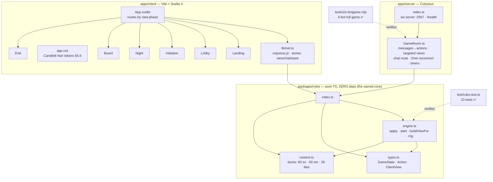
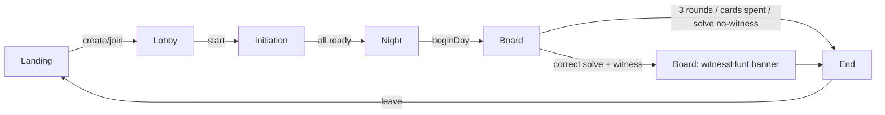

# Project Graph — গোয়েন্দাগিরি
*The living node-graph of the codebase. I (Claude) reference and update this every session — if code changes, this file changes in the same session.*
**Last updated:** 2026-07-10 (v0.2.0) · v1.6 rules: finalVote phase + ABSTAIN, VERDICT (pendingAccusation, detective-orchestrated mode), SWAP_DRAW/SWAP_CHOOSE (draw 2 keep 1, detective-only view) · 28 unit tests · e2e green · client 50 KB gz
*Graphify ran 2026-07-10 (Claude Code): output at `E:\GOYENDAGIRI\graphify-out\` (graph.html interactive · graph.json queryable · GRAPH_REPORT.md). God node = `apply()` (23 edges) — confirms the §4 invariant: everything funnels through one reducer. Known graph flaw: ~50 dangling edges from doc-subagent path stems (fix: `/graphify . --update --force`). This file stays the curated map; graphify-out is the auto-extracted one — use both.*

## 1. Module graph (what imports what)



## 2. Message flow (client ⇄ server)

```mermaid
sequenceDiagram
    participant C as Client (Svelte)
    participant R as GameRoom
    participant E as rules.apply()
    C->>R: send('accuse', {suspectSeat, evidenceId, meansId})
    R->>E: apply(state, ACCUSE)
    E-->>R: {next} or {error}
    alt error
      R-->>C: toast {msg}
    else state changed
      R->>R: state = next; arm timers
      loop every connected client
        R-->>C: view = buildViewFor(seat, state)  ← per-role filtered, §3.2
      end
    end
```
Full message catalog: design doc §6.6. Secrets travel ONLY inside per-seat `view.secret`, computed by `buildViewFor` — never broadcast.

## 3. Screen flow (client routes on `view.phase`)


Board.svelte internally hosts: tile board + marker confirm (detective), suspect grid (4-col), chat/log sidebar (desktop) / bottom bar + sheets (mobile <1024px), Easy Investigate overlay, Solve modal, role HUDs, witness-hunt panel.

## 4. Invariants the graph must never break

1. `packages/rules` imports NOTHING (no colyseus, no svelte, no node APIs). It is the test surface and the future-server escape hatch.
2. Secrets only flow through `buildViewFor` — any new server send must be checked against §3.2.
3. Client never computes game outcomes; it renders `view` and sends intents.
4. New rules → new test in `rules.test.ts` first; new message → e2e bot step.

## 5. File index

| Path | Role | Verified by |
|---|---|---|
| `goyendagiri/packages/rules/src/{types,content,engine,index}.ts` | game core | 23 unit tests ✅ |
| `goyendagiri/packages/rules/test/rules.test.ts` | rule coverage | — |
| `goyendagiri/apps/server/src/{index,GameRoom}.ts` | authoritative server | e2e bot game ✅ |
| `goyendagiri/apps/server/test/e2e-botgame.mjs` | network proof | — |
| `goyendagiri/apps/client/src/…` | Svelte SPA (6 screens) | vite build ✅ (45 KB gz); manual play pending |
| `mockups/goyendagiri-ui-demo.html` | design reference (candlelit noir) | HTML/JS checks ✅ |
| `docs/Goyendagiri-Design-Document.md` | the spec (v1.4) | traceability appx A |
| `docs/Artwork-Pipeline-Guide.md` | art workflow | — |
